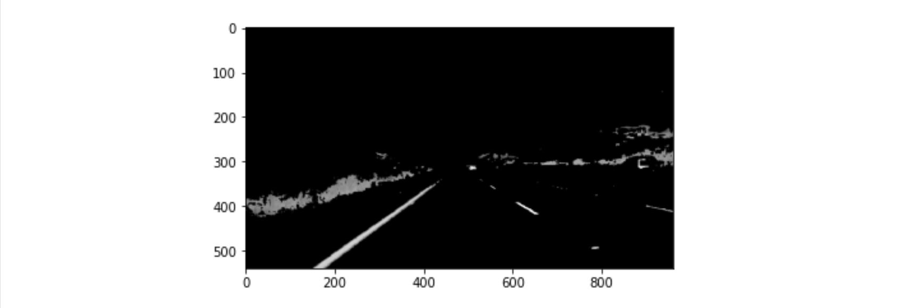
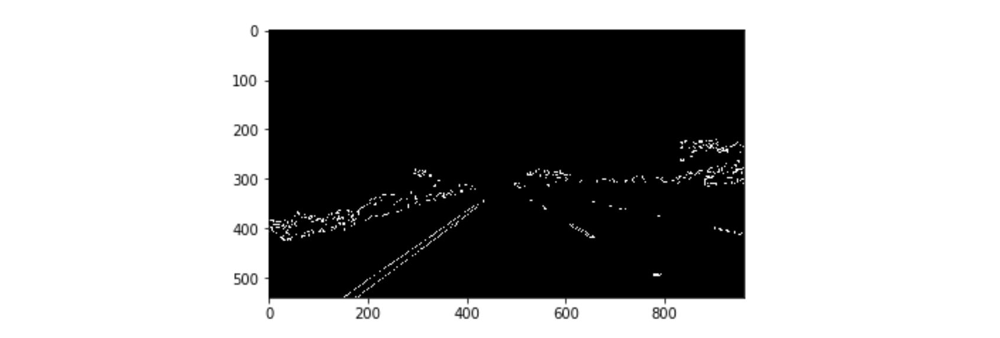

# Finding Lane Lines 

Computer Vision algorithm to detect straight lane lines markings on road using OpenCV Image Processing, Color Masks, Canny Edge Detection and Hough Transform. 


One of the most fundamental tasks in computer vision for autonomous driving is lane detection on road. Lane lines are painted for humans to see and follow while driving. In a very similar way, an autonomous vehicle that uses human designed infrastructure, needs to *see* the lane markings to steer accordingly and follow the road trajectory.

In this project I implemented a computer vision algorithm that processes real data recorded with the front facing camera of a vehicle driving on a California highway.
The result is a processed video that highlights the lane lines on the paved road. With the positions of the lane lines identified, the vehicle's offset from the lane's center can be calculated and feed a PD controller to compute the necessary steering angle. While only the lane lines detection is the scope of this project, my steering algorithm is implemented [here](https://github.com/OanaGaskey/PID-Controller)  
 
This project is implemented in Python and uses OpenCV image processing library. The source code can be found in the *finding_lane_lines.ipynb* Jupyter Notebook file above. 
The starter code for this project is provided by Udacity and can be found [here](https://github.com/udacity/CarND-LaneLines-P1).


## Define Color Masks

Looking at the video recording from the car, one of the most defining characteristics of lane lines is that they are white or yellow against a darker road color.


Defining color masks allows pixels selection in a image based on their color. The intention is to select only white and yellow pixels and set the rest of the image to black.


```
    ### create a color mask ###
    #convert from RGB to HSV
    hsv_img = cv2.cvtColor(img, cv2.COLOR_RGB2HSV)
    #define two color masks for yellow and white
    #white mask is applied in RGB color space, it's easier to tune the values
    #values from 200 to 255 on all colors are picked from trial and error
    mask_white = cv2.inRange(img, (200,200,200), (255, 255, 255))
    #yellow mask is done in HSV color space since it's easier to identify the hue of a certain color
    #values from 15 to 25 for hue and above 60 for saturation are picked from trial and error
    mask_yellow = cv2.inRange(hsv_img, (15,60,20), (25, 255, 255))
    #combine the two masks, both yellow and white pixels are of interest
    color_mask = cv2.bitwise_or(mask_white, mask_yellow)
    #make a copy of the original image
    masked_img = np.copy(img)
    #pixels that are not part of the mask(neither white or yellow) are made black
    masked_img[color_mask == 0] = [0,0,0]
    
```

Image processing techniques can be applied to RGB colorspace but for color selection, the HSV space is much better. Hue, Saturation and Value are easier to work with mainly because the *hue* value carries the color of each pixel.

The yellow mask is built from the HSV image to select pixels with hue between 15 and 25 and saturation above 60. These values were identified from the images to be corresponding to the yellow lane markings.
The white mask is built from the RGB image where all three color channels of a pixel have to be above 
the threshold value of 200. This accurately selects the white markings on the pavement.

The two masks are applied using *bitwise or* so both white and yellow pixels are kept. All other pixels are set to black. With this selection all lane lines pixels are correctly selected. There is also noise, from dried grass that corresponds to the yellow collor and white cars on the highway. This will be removed with further processing.


## Smoothen Image

Once the image is masked and only white and yellow pixels are kept, color is no longer important so the image is turned into grayscale for easier processing.  

```
    ### smoothen image ###
    #turn the masked image to grayscale for easier processing
    gray_img = grayscale(masked_img)
    #to get rid of imperfections, apply the gaussian blur
    #kernel chosen 5, no other values are changed the implicit ones work just fine
    kernel_size = 5
    blurred_gray_img = gaussian_blur(gray_img, kernel_size)
```





To prepare for edge detection it is usefull to smoothen the image so artificial edges are not detected due to noise. For this the Gaussian blurr is applied with kernel 5 and further default values.


## Detect Edges

For lane line detection purposes edge detection is used. It is much better to work with edges than the whole body of the lane line. The main reason for this is the further need to compute line equations from independent pixels. 

```
    ### detect edges ###
    #choose values for te Canny Edge Detection Filter
    #for the differentioal value threshold chosen is 150 which is pretty high given that the max difference between black and white is 255
    #low threshold of 50 which takes adjacent differential of 50 pixels as part of the edge
    low_threshold = 50
    high_threshold = 150
    edges_from_img = cv2.Canny(blurred_gray_img, low_threshold, high_threshold)
```




Edges are detected using the Canny Edge Filter appliend on a grayscale image. The Canny Edge Filter is essentially computing the gradient across the image with respect to x and y directions, the resulting matrix representing the difference in intensity between adjecent pixels.
The algorithm will first detect strong edge (strong gradient) pixels above the high_threshold (150 for our images), and reject pixels below the low_threshold (here chosen to be 50). Next, pixels with values between the low_threshold and high_threshold will be included as long as they are connected to strong edges. The output edges is a binary image with white pixels tracing out the detected edges and black everywhere else.


## Select Region of Interest

In the edge processing resulting image, the lane line edges are correctly identified, but there are a lot of other unnecessary edges as well. These are mainly from objects located outside of the road, or maybe edges defining boundaries of other cars. To eliminate this noise, I took advantage of the constant region of interest in the image.

```
    ### select region of interest###
    #define a polygon that should frme the road given that the camera is in a fixed position
    #polygon covers the bottom left and bottom right points of the picture
    #with the other two top points it forms a trapezoid that points towards the center of the image
    #the polygon is relative to the image's size
    imshape = img.shape
    vertices = np.array([[(0,imshape[0]),(4*imshape[1]/9, 6*imshape[0]/10), (5*imshape[1]/9, 6*imshape[0]/10), (imshape[1],imshape[0])]], dtype=np.int32)
    masked_edges = region_of_interest(edges_from_img, vertices)
```

A polygon is defined based on the hypothesis that the camera is mounted on a fixed position on the car. A trapezoid is selected that starts at the bottom of the image and goes towards the center. The values are identified visually from the pictures.

The `region_of_interest` function creates a mask using `cv2.fillPoly(mask, vertices, 255)`. `mask` is initially a zeroes matrix of the same size as the grayscale image. The `fillPoly` creates a polygon based on the given vertices and sets all the pixels within to `255`. The mask is applied using `bitwise_and` to the grayscale image.


## Find Lines from Edge Pixels
Hough transform is used to form lines from colinear pixels. The Hough grid resolution is set to 2 pixels and the angular resolution to one radian. The minimum line length is 10 pixels and the maximum gap between two segments of the same line is 5 pixels. These values were found in the previous lessons. These lines are found with the "hough_lines" function that applies the transform on the edges in the region of interest.
Once the lines found, they are drawn over the original image for confirmation.


In order to draw a single line on the left and right lanes the draw_lines function is built as follows. Lines from Hough tranform are grouped in left and right category based on the computed slope. Negative slope means it's part of the left line, positive slope means it's part of the right line. Once grouped, a symetric approach is used for each side. I calculated the average slope of all the lines from one side and their standard deviation. In order to eliminate lines that are not aligned with the rest, only lines that have a consistent slope are kept. From the kept lines I calculated the average slope and intercept.
In case there are no lines detected in the picture, or if the lines are not aligned well enough, default values are used. The default values for slope and intercept are taken from running the algorithm on "solidWhiteRight.jpg" picture.
Using the slope and intercept of the line, the extrapolation is performed to match the hight of the region of interest. This is done by calculatig the intersection points of the line with the horizontal middle edge: y = 6.imshape[0]/10 and with the horizontal bottom line of  the image: y = imshape[0]
Using the two intersection points, the extrapolated line is drawn on the original image. The line is semi transparent so a visual check can be made to verify if the line correspnds with the lane markings. Symmetrically the same logic is applied on the right side.
For better visualization, the left line is green while the right one is blue.
 


